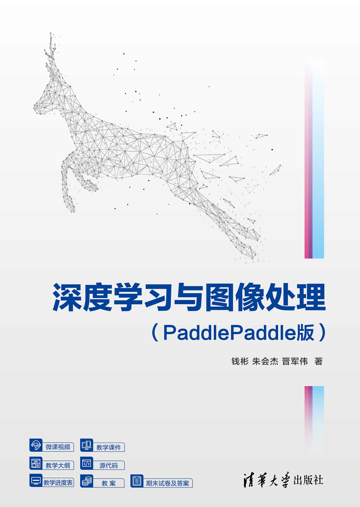
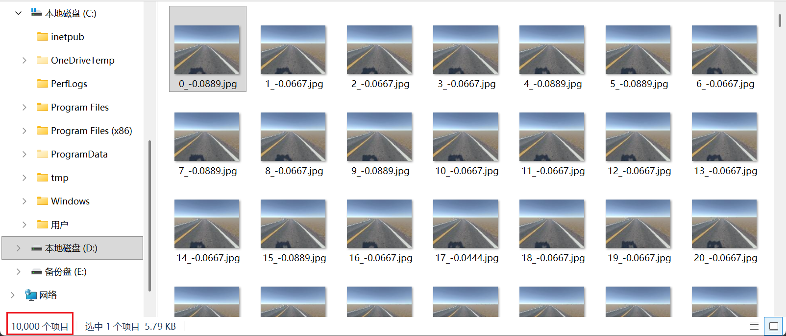
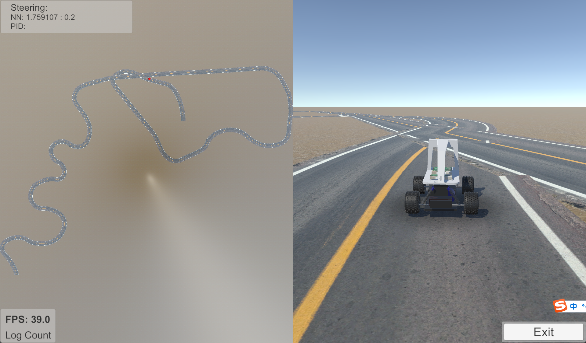
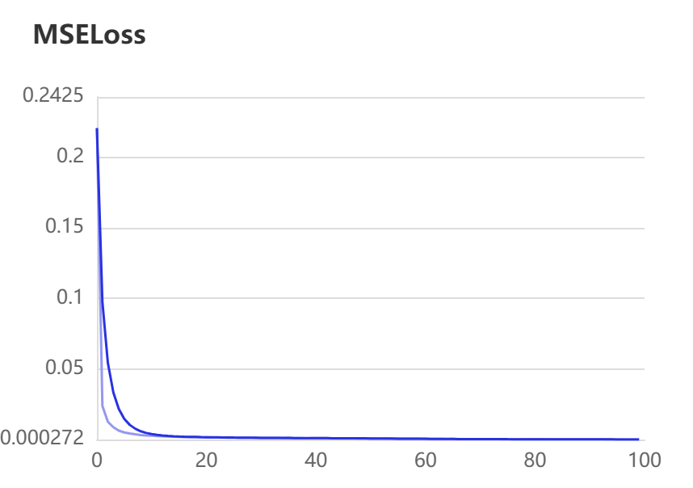
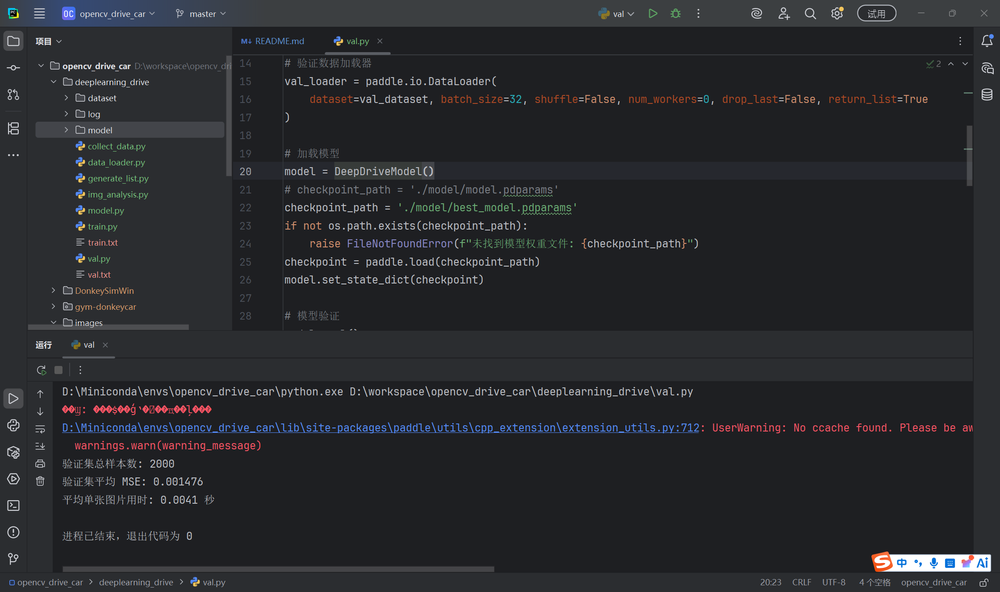
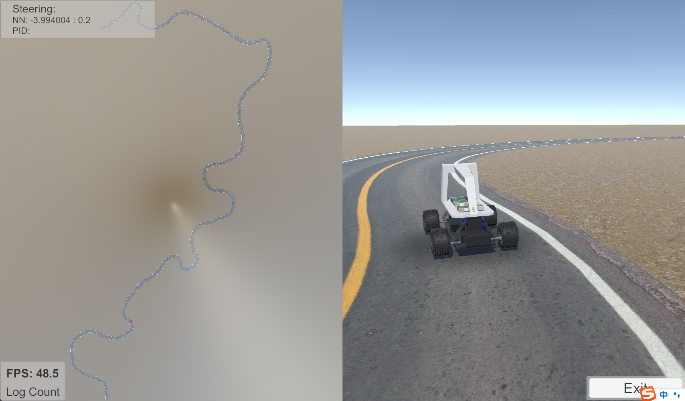

## DonkeyCar自动驾驶小车项目

#### 写在前面

首先，本项目来源于《深度学习与图像处理（PaddlePaddle版）》（钱彬 著）


然后，复现和优化该项目让我获益匪浅，十分感谢钱彬老师的分享

最后，如有疑问可以添加书籍作者的交流群 820106877，以及 871302808（B站UP幽蓝伊梦的学习交流群）欢迎各位大佬的加入

#### 项目简介

项目整体可以分成两个部分：
前一部分使用opencv分析图像，针对仿真软件中的反馈图像进行感知（检测车道线）和动作规划（操控转向），
后一部分使用paddle搭建网络模型，使用10,000张基于opencv的处理图像训练模型，并进行一定的可视化呈现

代码中添加了较为详细的注释，以及部分代码优化，使得零基础同学也可以无障碍学习，虽然概率很低，但希望能够帮助到某位同学

#### 环境准备

我使用的是conda环境，相关具体操作请自行搜索，项目整体结构如下：

```text
├── deeplearning_drive
│   ├── dataset
│   │   ├── 1000_-0.2222.jpg
│   │   ├── 1001_-0.2667.jpg
│   │   ├── 1002_-0.2444.jpg
│   │   ├── 1003_-0.2444.jpg
│   │   ├── 1004_-0.2667.jpg
│   │   ├── 1005_-0.2444.jpg
│   │   ├── ... ... 
│   ├── log
│   │   └── vdlrecords.1779182184.log
│   ├── model
│   │   ├── best_model.pdparams
│   │   ├── last_model.pdparams
│   │   └── model.pdparams
│   ├── collect_data.py
│   ├── data_loader.py
│   ├── deep_drive.py
│   ├── generate_list.py
│   ├── img_analysis.py
│   ├── model.py
│   ├── train.py
│   ├── train.txt
│   ├── unitylog.txt
│   ├── val.py
│   └── val.txt
├── DonkeySimWin
│   ├── ... ...
├── gym-donkeycar
│   ├── ... ...
├── images
│   ├── book_picture.jpg
│   ├── MSELoss.png
│   ├── ... ...
├── opencv_drive_car
│   ├── output
│   │   ├── test_drive.jpg
│   │   ├── ... ...
│   ├── auto_drive.py
│   ├── img_analysis.py
│   ├── test_drive.py
│   └── unitylog.txt
├── README.md
```

donkeycar：https://donkeycar.cn/

gym：https://github.com/tawnkramer/gym-donkeycar/releases

paddle：https://github.com/PaddlePaddle/PaddleGAN/blob/develop/docs/zh_CN/install.md

可以打开仿真软件，先选中manual Driving手动控制小车体验一下操作


#### 获取图像

运行代码，获得基本的赛道图像


#### 检测车道

基于HSV空间的特定颜色区域提取，效果如下


基于高斯模糊的噪声过滤，效果如下


基于Canny算法的边缘轮廓提取，效果如下


感兴趣区域（ROI）提取，效果如下


基于霍夫变换（HT）的线段检测，效果如下


#### 动作控制

在固定油门值为0.2的情况下，根据两条车道线计算转向角度控制小车


注意仿真软件每次生成的赛道是随机的，如果赛道存在十字路口或者过于复杂可能出现检测失败、冲出赛道的情况


#### 数据采集

根据上一节分析图像和自动驾驶的代码，调整一下作为本节的数据集，每张图像命名为“图像帧编号_转向角度.jpg”



建议收集时稍微看一下运行过程，不要采集包含十字路口的图像



按照0.8的比例随机拆分出训练集（8000张）和验证集（2000张），以train.txt为例数据格式如下

```text
dataset/6023_-0.2000.jpg -0.2000
dataset/1745_0.0000.jpg 0.0000
dataset/5374_0.0222.jpg 0.0222
dataset/2009_-0.1333.jpg -0.1333
dataset/8120_0.0222.jpg 0.0222
```

#### 模型训练

准备数据、搭建模型、损失函数，然后就是训练（因为本项目数据量较小，可以使用CPU进行训练） ，或者使用飞桨社区的算力卡进行GPU训练

安装visualdl查看训练过程，打开浏览器访问 http://localhost:8040

```text
(opencv_drive_car) D:\workspace\opencv_drive_car>visualdl --logdir deeplearning_drive/log
```



#### 模型验证

评估训练好的模型性能



#### 模型集成

使用模型，控制小车执行动作，部分执行日志如下

```text
starting DonkeyGym env
Setting default: start_delay 5.0
Setting default: max_cte 8.0
Setting default: frame_skip 1
Setting default: cam_resolution (120, 160, 3)
Setting default: log_level 20
Setting default: host localhost
Setting default: steer_limit 1.0
Setting default: throttle_min 0.0
Setting default: throttle_max 1.0
donkey subprocess started
loading scene generated_road
当前转向角度： -0.040544167
当前转向角度： -0.03807132
当前转向角度： -0.034253404
... ...
当前转向角度： 0.008305684
当前转向角度： 0.008212611
当前转向角度： 0.020580843
当前转向角度： 0.010675237
当前转向角度： 0.048293248
closing donkey sim subprocess
```


