## DonkeyCar自动驾驶小车项目

#### 写在前面

首先，本项目来源于《深度学习与图像处理（PaddlePaddle版）》（钱彬 著）

然后，复现和优化该项目以及撰写文档让我获益匪浅，感谢钱彬老师的分享

最后，如有疑问可以添加书籍作者的交流群 820106877，欢迎各位大佬的加入

#### 项目简介

0可以分为感知（检测车道线）和动作规划（操控转向）两部分
添加了较为详细的注释，使得零基础同学也可以无障碍学习

#### 环境准备

我使用的是conda环境，相关具体操作请自行搜索，项目整体结构如下：

驴车官网：https://donkeycar.cn/

gym：https://github.com/tawnkramer/gym-donkeycar/releases

可以打开仿真软件，先选中manual Driving手动控制小车体验一下操作

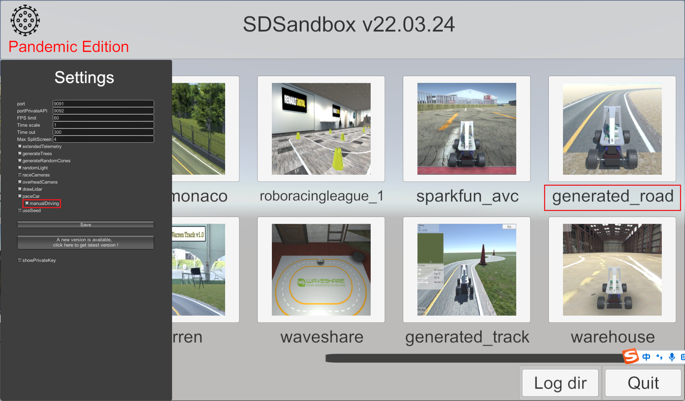

#### 获取图像

运行代码，获得基本的赛道图像

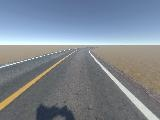

#### 检测车道

基于HSV空间的特定颜色区域提取，效果如下

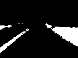
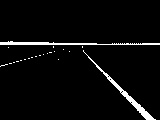

基于高斯模糊的噪声过滤，效果如下

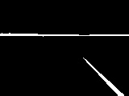

基于Canny算法的边缘轮廓提取，效果如下

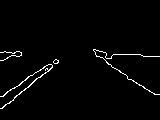
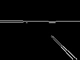

感兴趣区域（ROI）提取，效果如下

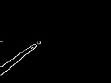
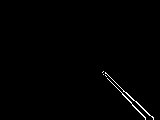

基于霍夫变换（HT）的线段检测，效果如下

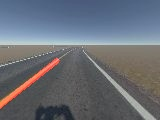
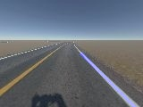

#### 动作控制

在固定油门值为0.2的情况下，根据两条车道线计算转向角度控制小车

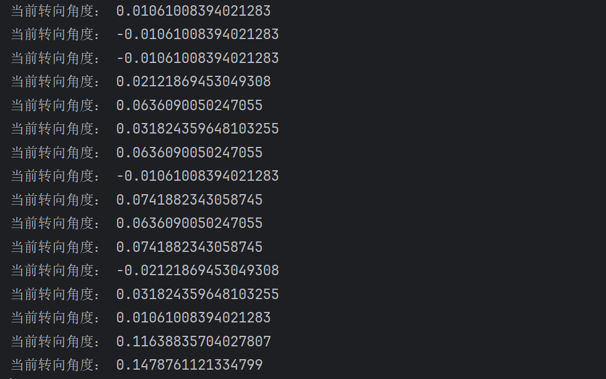

注意仿真软件每次生成的赛道是随机的，如果赛道存在十字路口或者过于复杂可能出现检测失败、冲出赛道的情况

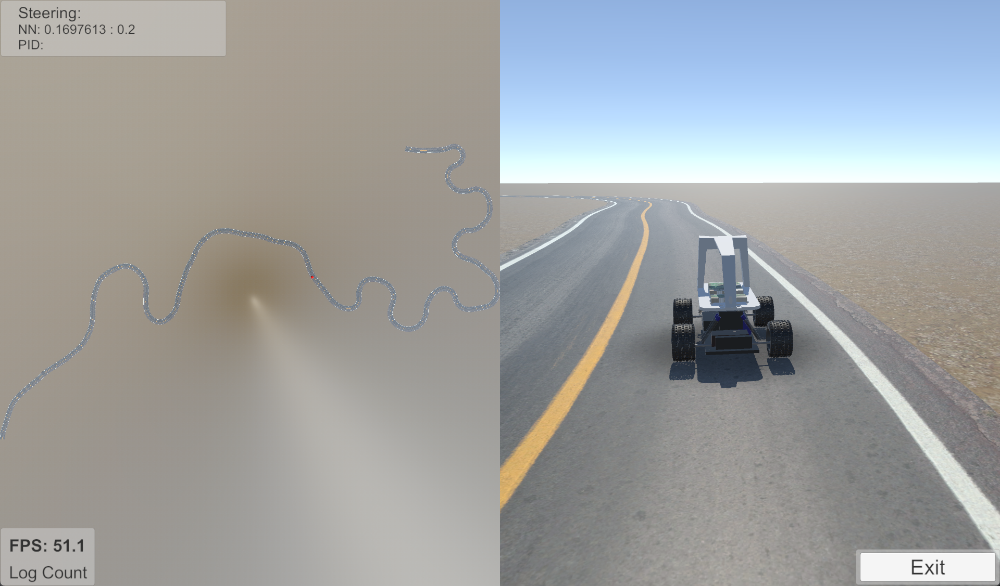
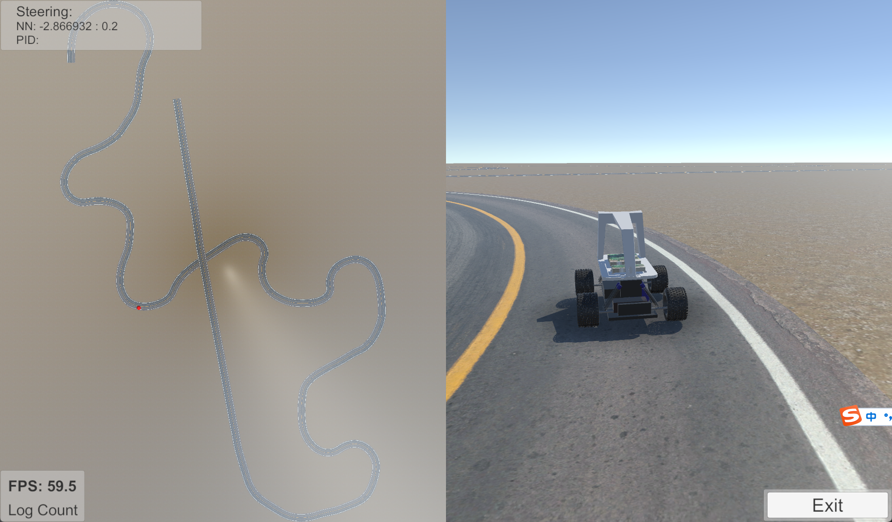

#### 数据采集

